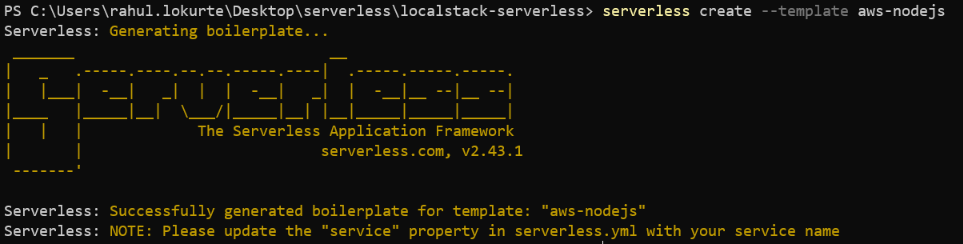

The serverless framework is an open source tool used for developing and deploying the serverless applications. It is vendor neutral framework as it can be used with AWS, Azure or GCP. It provides a full serverless application lifecycle management.

## Install the serverless CLI

Install the serverless CLI using npm as shown below. This will install serverless CLI globally.

```javascript
npm install -g serverless
```

## Configure AWS credentials

Configure the serverless with AWS credentials using below command. The provider is AWS and we need to set the accesskey and secretkey.

```javascript
serverless config credential --provider aws --key fakeaccesskey --secret fakesecretkey
```

## Install serverless-localstack plugin

This plugin is required to run the serverless to support running against the localstack. This plugin allows Serverless applications to be deployed and tested on your local machine. Any requests to AWS to be redirected to a running LocalStack instance.

```javascript
npm install --save-dev serverless-localstack
```

## Create a new serverless project

Serverless provides various templates which we can use to get headstart. To see a list of available templates run below command.

```javascript
npm serverless create --help

```

Let us select the aws-nodejs as shown below

```javascript
serverless create --template aws-nodejs

```



Once the project is created successfully, you will see the below code.

1. **handler.js**

```javascript
"use strict";

module.exports.hello = async (event) => {
  return {
    statusCode: 200,
    body: JSON.stringify(
      {
        message: "Go Serverless v1.0! Your function executed successfully!",
        input: event,
      },
      null,
      2
    ),
  };

  // Use this code if you don't use the http event with the LAMBDA-PROXY integration
  // return { message: 'Go Serverless v1.0! Your function executed successfully!', event };
};
```

2. **serverless.yml**

```yaml
service: localstack-serverless
frameworkVersion: "2"

provider:
  name: aws
  runtime: nodejs12.x
  lambdaHashingVersion: 20201221

functions:
  hello:
    handler: handler.hello
```

Let us now update the serverless.yml file to include the LocalStack plugin as shown below.

```yaml
service: localstack-serverless
plugins:
  - serverless-localstack

custom:
  localstack:
    debug: true
    stages:
      - development
    endpointFile: endpoints.json
frameworkVersion: "2"

provider:
  name: aws
  runtime: nodejs14.x
  lambdaHashingVersion: 20201221

functions:
  hello:
    handler: handler.hello
```
