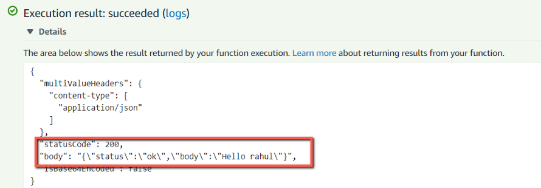

Serverless application can be easily created with AWS lambda and AWS Gateway. We can write an lambda function and configure the gateway. We get a Rest endpoint which we can call to reach the lambda function. This approach is easy, but comes with a caveats. We have to configure API gateway, manage the deployments, publish to stages.

In this blog, we will see how to develop and deploy a serverless application using
<a href="https://www.npmjs.com/package/lambda-api" target="_blank">**Lambda API**</a>, a lightweight framework for developing serverless applications.

Lets create a new project directory.

```sh
mkdir serverless-samples
cd serverless-samples
```

We will initiate the project and Install lambda-api.

```sh
npm init
npm i lambda-api
```

The Lambda-api just needs the 3 steps.

1. Require the framework and Instantiate it.
2. Define a route.
3. Declare our Lambda Handler.

Create a new handler.js file and add the below contents.

```javascript
//----------------------------------------------------------------------------//
// Require the framework
//----------------------------------------------------------------------------//

const app = require("lambda-api")({ version: "v1.0", base: "v1" });

//----------------------------------------------------------------------------//
// Define an API routes
//----------------------------------------------------------------------------//

// GET
app.get("/greet/:name", (req, res) => {
  // Send the response
  res.status(200).json({
    //name: req.params,
    status: "ok",
    body: "Hello " + req.params.name,
  });
});

//----------------------------------------------------------------------------//
// Lambda handler
//----------------------------------------------------------------------------//
module.exports.router = (event, context, callback) => {
  context.callbackWaitsForEmptyEventLoop = false;

  // Run the request
  app.run(event, context, callback);
}; // end router handler
```

In the above code, we have created an GET endpoint with **_/greet/:name_**. The Path parameter is **_name_** which will be passed to the GET endpoint. The API will return the response with statuscode as 200 and the body will greet a person with name that is passed in the pathparams. To run the request, we use **_app.run()_** method.

## Deploy to AWS

Login into AWS and search for Lambda service. Create a new function, provide the name and Runtime as shown below.


Create a zip file of the project and upload the zip file to function **_serverless-sample_** and change the handler to **_handler.router_**.


Invoke the function with a test event. We need to choose the template that matches the service that triggers our function or we can also create a event document in Json.


As shown above, we have to select a **_New event_** option and select **_apigateway-aws-proxy_** template and give an test event name as **_gatewaysample_**. We will get a sample event which is compatible with the api-gateway.

Now test the endpoint by adding values to below keys.

1. "resource": "/v1/greet/rahul"
2. "path": "/v1/greet/rahul"
3. "httpMethod": "GET"

Once configured, click on Test button, We get the below greeting for the name passed into the function.


