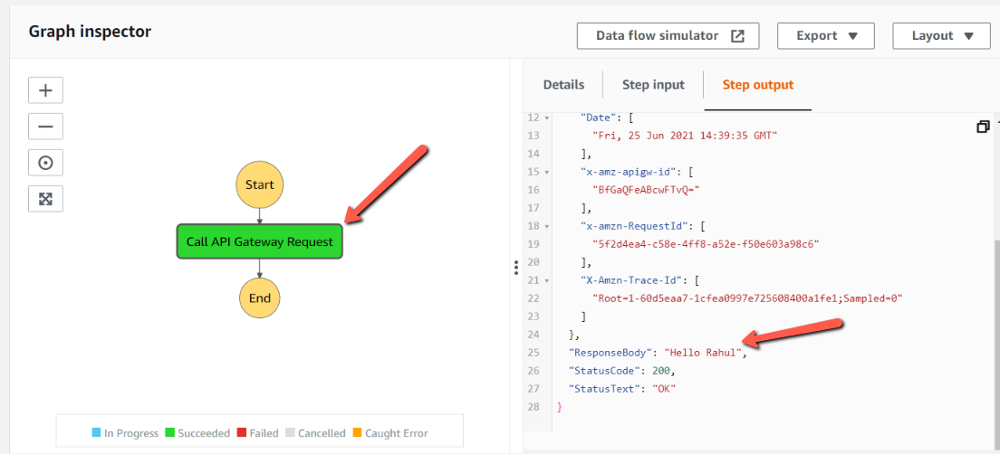

AWS Step Functions is a serverless function orchestrator used to create a simple and complex workflows required for business critical applications. In this blog post, we will expose an API using AWS Apigateway. Then, we will create a step function, which will call an Api Gateway directly within the workflow.

We use Amazon API Gateway to create, publish HTTP and REST APIs. For the step functions to integrate directly with Amazon API gateway, we need to define a **_Task_** state in a Step Functions, which we can use to call the API gateway Http or Rest endpoint. All the nexessary information to call the API Gateway should be defined in the Task state.

## Create an Lambda Function and API Gateway

Let us create an Lambda Function and expose it through API Gateway.

Create an **_GreetUser_** Lambda function and add the below code to index.js

```javascript
exports.handler = async (event) => {
  console.log(event);
  let user = event.pathParameters.user;

  const response = {
    statusCode: 200,
    body: "Hello " + user,
  };
  return response;
};
```

The above lambda function looks into the path parameter for the user and greets the user passed into it.
We can now create an API gateway **_MockApi_** with the following endpoint **_/greet/{user}_** as shown below and point the integration type to **_GreetUser_** Lambda Function.


After that, go to Actions and click on deploy and select the stage as v1. After that, we get an API endpoint for our greet user, which we will call from step function.


So, we can call https://<endpoint-id>.execute-api.ap-south-1.amazonaws.com/v1/greet/rahul to get the response.

## Create a Step Function

We will create a step Function **_GreetUserStep_**. Choose the authoring method as **_Write your workflow in code._** and select the Type as **_standard_**.

Add the below definition to the step function.

```json
{
  "Comment": "An Example to call API Gateway from Step Function",
  "StartAt": "Call API Gateway Request",
  "States": {
    "Call API Gateway Request": {
      "Type": "Task",
      "Resource": "arn:aws:states:::apigateway:invoke",
      "Parameters": {
        "ApiEndpoint": "<your-api>.execute-api.ap-south-1.amazonaws.com",
        "Method": "GET",
        "Stage": "v1",
        "Path": "/greet/Rahul"
      },
      "End": true
    }
  }
}
```

Here we have a state **_Call API Gateway Request_** of type **_Task_**. The Parameters field will contain all the required things to call an API Gateway. We are making a GET endpoint with path **_/greet/Rahul_**

Now, if click on start execution, we will get the execution result as shown below.



As we see in the above screenshot, we see that, it called the API Gateway and we can also see the ResponseBody as indication.

## Conclusion

This blog post explained about the Step functions and how we can call the API Gateway from Step Functions directly. For more information on Step Functions refer to the amazing documentation from Amazon <a href="https://aws.amazon.com/step-functions/?step-functions.sort-by=item.additionalFields.postDateTime&step-functions.sort-order=desc" target="_blank">**here**</a>
