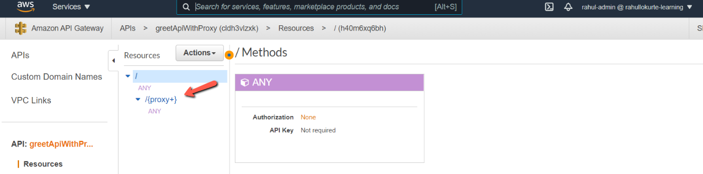
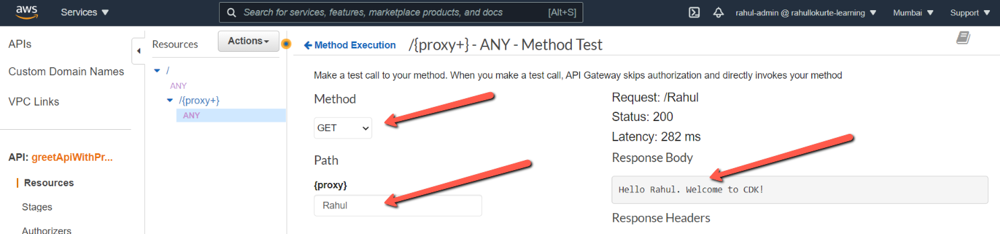
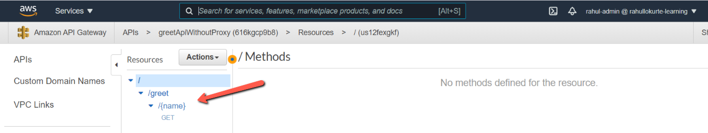
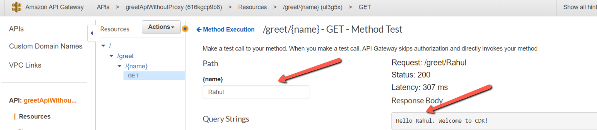

Amazon API Gateway is a fully managed service that makes it easy for developers to publish, maintain, monitor, and secure APIs at any scale. Create an API to access data, business logic, or functionality from your back-end services, such as applications running on Amazon Elastic Compute Cloud (Amazon EC2), code running on AWS Lambda, or any web application.

AWS CDK (Cloud Development Kit) is a framework that allows developer to use familiar programming languages to define AWS cloud infrastructure and provision it. CDK provides the **_Constructs_** cloud component that cover many of the AWS services and features. It helps us to define our application infrastructure at high level.

In this post, we will create a API Gateway using AWS CDK and connect it to lambda which we was developed in <a href="https://rahullokurte.in/posts/2021-07-08/AWS-Lambda-Using-CDK/" target="_blank">**AWS Lambda Using CDK**</a> blog.

There are two types of integration of API Gateway with Lambda can be done.We can have the Lambda proxy integration, or the Lambda custom integration.

## Lambda Integration With Proxy

A very common practice is to use Amazon API Gateway with AWS Lambda as the backend integration. The LambdaRestApi construct makes it easy.

Edit the file lib/cdk-greetapp-stack.js to create an AWS Gateway resource as shown below.

```javascript
// defines an AWS API Gateway resource With Proxy
const apiGatewayWithProxy = new gateway.LambdaRestApi(
  this,
  "greetApiWithProxy",
  {
    handler: greet,
  }
);
```

The above code defines a Gateway REST API that routes all requests to the specified AWS Lambda function **_greet_**.

After adding the above code, make sure the resources are as expected by using command `cdk diff` and once, verified, deploy the stack using `cdk deploy`.

Once deployment is done, go to the AWS console and you see **_greetApiWithProxy_** Api


Now, if you check the Resources, you can see the proxy resource and **_ANY_** method, which means all requests are routed to AWS Lambda function **_greet_**.



Click on **_ANY_** and click on Test and add the below details and you can see the result as shown below.



## Lambda Integration Without Proxy

Let us create one more API without proxy integration to lambda. In this, implementation, we need to explicitly define the API model and make **proxy** as **_false_**.

```javascript
// defines an AWS API Gateway resource Without Proxy
const apiGatewayWithoutProxy = new gateway.LambdaRestApi(
  this,
  "greetApiWithoutProxy",
  {
    handler: greet,
    proxy: false,
  }
);

const greetResources = apiGatewayWithoutProxy.root.addResource("greet");
const greetResource = greetResources.addResource("{name}");
greetResource.addMethod("GET");
```

The above code defines a Gateway REST API that routes the **_GET_** requests to the resource **_/greet/{name}_** of AWS Lambda function **_greet_**.

After adding the above code, make sure the resources are as expected by using command `cdk diff` and once, verified, deploy the stack using `cdk deploy`.

Once deployment is done, go to the AWS console and you see **_greetApiWithoutProxy_** Api


Now, if you check the Resources, you can see the proxy resource **_/greet/{name}_** and **_GET_** method.



Click on **_GET_** and click on Test and add the below details and you can see the result as shown below.



## Conclusion

In this blog post, we saw how to create a AWS Api Gateway by using AWS Cloud Development Kit. We also saw various ways in which we can integrate the Api Gateway with Lambda. We saw how to create a proxy resource and custom resource.
