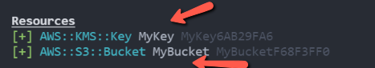
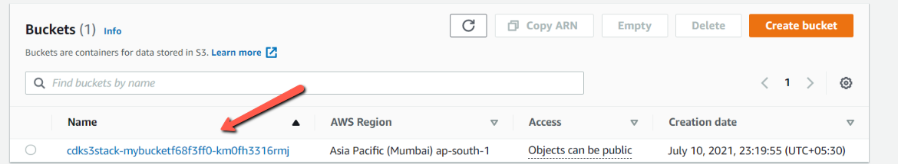
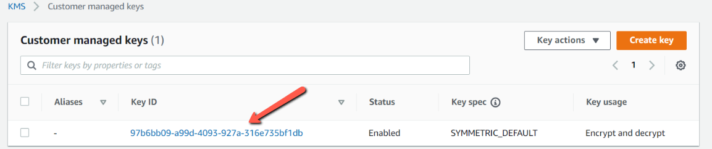

Amazon simple storage service (S3) is an object storage built to store and retrieve unlimited amount of data. We can use it to store various kinds of data. We can have data lakes to push the data into S3, we can collect the click events of an web application, we can also use it for data analytics.

Files on S3 are stored in **_buckets_**, which are unlimited in size and each bucket has a globally unique name.

In this blog post, we're going to create and deploy a new S3 bucket to AWS Using Cloud Development Kit.

Create a new directory on your system.

```sh
mkdir cdk-s3 && cd cdk-s3
```

We will use cdk init to create a new Javascript CDK project:

```sh
cdk init --language javascript
```

The cdk init command creates a number of files and folders inside the **_cdk-s3_** directory to help us organize the source code for your AWS CDK app.

We can list the stacks in our app by running the below command. It will show CdkS3Stack.

```sh
_$ cdk ls
CdkS3Stack
```

Let us install AWS S3 construct library and AWS Key Management Service (KMS) to protect the keys.

```sh
npm install @aws-cdk/aws-s3 @aws-cdk/aws-kms
```

Edit the file lib/cdk-s3-stack.js to create an AWS lammbda resource as shown below.

```javascript
const cdk = require("@aws-cdk/core");
const kms = require("@aws-cdk/aws-kms");
const s3 = require("@aws-cdk/aws-s3");

class CdkS3Stack extends cdk.Stack {
  /**
   *
   * @param {cdk.Construct} scope
   * @param {string} id
   * @param {cdk.StackProps=} props
   */
  constructor(scope, id, props) {
    super(scope, id, props);

    // The code that defines your stack goes here
    const myKmsKey = new kms.Key(this, "MyKey", {
      enableKeyRotation: true,
    });

    const myBucket = new s3.Bucket(this, "MyBucket", {
      bucketName: cdk.PhysicalName.GENERATE_IF_NEEDED,
      encryption: s3.BucketEncryption.KMS,
      encryptionKey: myKmsKey,
      versioned: true,
    });
  }
}

module.exports = { CdkS3Stack };
```

- The Bucketname will be Generated one.

- We are using KMS encryption and the Key which we have defined **_myKmsKey_** .

- Versioning is set to true.

Before deploying the AWS resource, we can take a look on what resources will be getting created by using below command.

```sh
cdk diff
```



**NOTE**: If we have multiple profiles set in our system, we need to tell cdk to look into particular profile. This can be done, by adding below key-value in **_cdk.json_** which was generated when we created a CDK project.

```json
"profile": "<YOUR_PROFILE_NAME>"
```

Now, once we are ok with the resources which will be created, we can deploy it using below command

```sh
cdk deploy
```

Let us open the AWS Lambda console. We can see that S3 bucket has been created.



We can also see the KMS which we have created.



## Conclusion

In this blog post, we saw how to create a S3 Bucket and also KMS by using AWS Cloud Development Kit. We also saw various commands related to CDK for initiating project, deploying the resources to AWS. The associated Git Repository is <a href="https://github.com/rahulmlokurte/aws-usage/tree/main/aws-cdk/cdk-s3" target="_blank">**here**</a>
