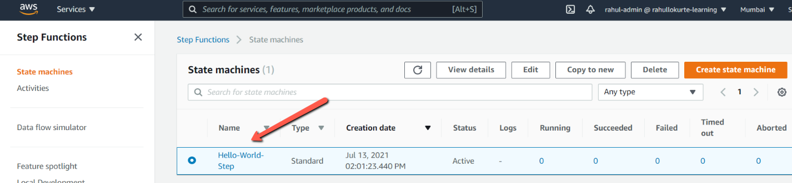
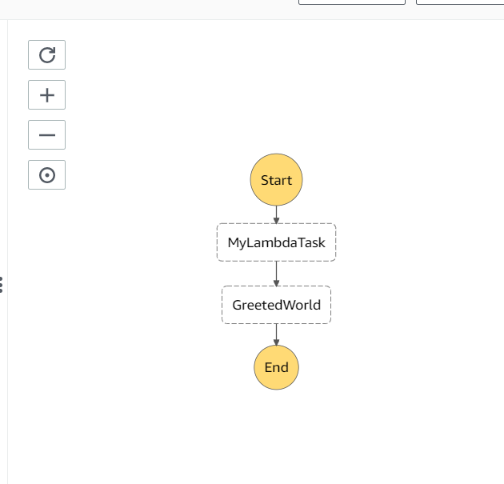
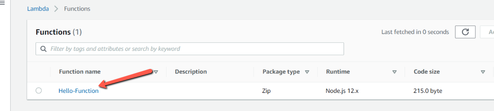
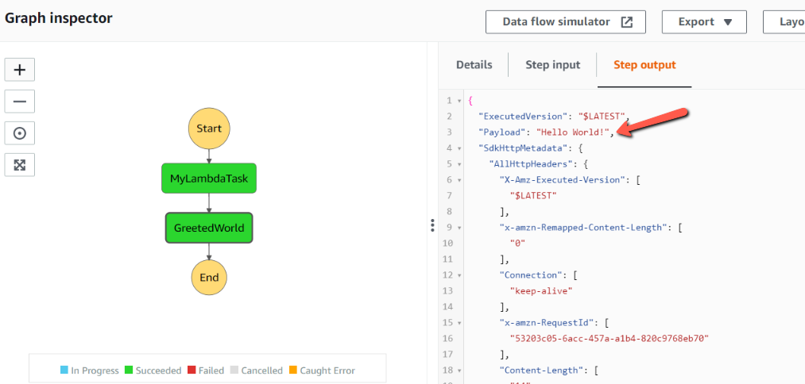

AWS Step Function service is usued to orchestrate a workflow consisting of serverless Functions and integrating with other AWS service to bundle application.

In this blog post, we will look at how to orchestrate a lambda functions to State Machine using AWS Step Functions.

Create a new directory on your system.

```sh
mkdir cdk-step && cd cdk-step
```

We will use cdk init to create a new Javascript CDK project:

```sh
cdk init --language javascript
```

The cdk init command creates a number of files and folders inside the **_cdk-step_** directory to help us organize the source code for your AWS CDK app.

We can list the stacks in our app by running the below command. It will show CdkStepStack.

```sh
_$ cdk ls
CdkStepStack
```

Let us install AWS lambda, aws stepfunctions and aws step functions task dependencies

```sh
npm install @aws-cdk/aws-lambda @aws-cdk/aws-stepfunctions @aws-cdk/aws-stepfunctions-tasks
```

Create an AWS Lambda Function **_Hello-Function_** with inline code:

```javascript
const helloFunction = new lambda.Function(this, "MyLambdaFunction", {
  functionName: "Hello-Function",
  code: lambda.Code.fromInline(`
          exports.handler = (event, context, callback) => {
              callback(null, "Hello World!");
          };
      `),
  runtime: lambda.Runtime.NODEJS_12_X,
  handler: "index.handler",
  timeout: cdk.Duration.seconds(25),
});
```

- The functionName is the name of our lambda function.
- The code is where we put the inline code for our lambda function.
- Nodejs 12.x is used as a runtime.
- The handler will create a file **_index.js_** and exports the **_handler_** method.
- Timeout duration will be 25 seconds.

Create the Step definitions:

```javascript
const definition = new tasks.LambdaInvoke(this, "MyLambdaTask", {
  lambdaFunction: helloFunction,
}).next(new sfn.Succeed(this, "GreetedWorld"));
```

- The task is to invoke **_Hello-Function_** lambda
- The lambda just passes into the Succeed Step which is inbuilt step
- It return output as GreetedWorld

Let us create a StateMachine with AWS Step Function.

```javascript
const stateMachine = new sfn.StateMachine(this, "MyStateMachine", {
  stateMachineName: "Hello-World-Step",
  definition,
});
```

Before deploying the AWS resource, we can take a look on what resources will be getting created by using below command.

```sh
cdk diff
```

**NOTE**: If we have multiple profiles set in our system, we need to tell cdk to look into particular profile. This can be done, by adding below key-value in **_cdk.json_** which was generated when we created a CDK project.

```json
"profile": "<YOUR_PROFILE_NAME>"
```

Now, once we are ok with the resources which will be created, we can deploy it using below command

```sh
cdk deploy
```

Let us open the AWS Lambda console. We can see that StateMachine, Step Function and Lambda has been created.





Now Go to the Step Function **_Hello-World-Step_** and click on **_Start execution_** button. We can see the execution details of the Step Function.



## Conclusion

In this blog post, we saw how to create a StateMachine and Step Functions using AWS Cloud Development Kit. We also saw various commands related to CDK for initiating project, deploying the resources to AWS. The associated Git Repository is <a href="https://github.com/rahulmlokurte/aws-usage/tree/main/aws-cdk/cdk-step" target="_blank">**here**</a>
