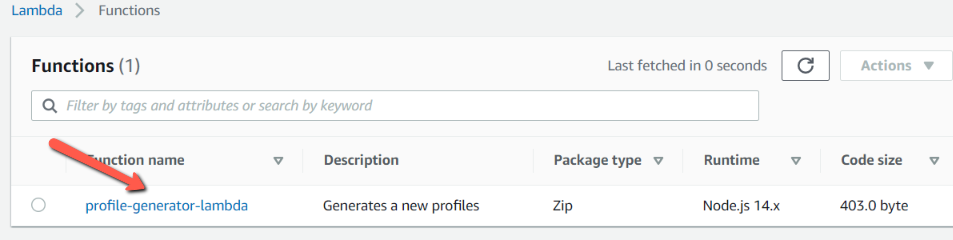

Terraform allows infrastructure to be expressed as code, in a language called **HCL** (**_HashiCorp Configuration Language_**). Terraform registry contains various Terraform providers and modules for quickly deploying the common infrastructure configurations.

Providers are the plugins that will implement the resource types. We can find many different cloud providers which includes major cloud providers like AWS, Azure, GCP.

Modules are the small, reusable Terraform configurations which lets us manage a group of related resources as single resource.

In this blog post, we will use **_aws_** provider and the module **_terraform-aws-modules/lambda/aws_** to create lambda and lambda layer.

## 10000 Feet Overview

Basically there are three steps to deliver the infrastructure as Code.

- Write the infrastructure as code in a configuration files using HashiCorp Configuration Language, then run the command `terraform init` to initiatize the terraform.

- Before provisioning the infrastructure, check if a plan matches the expectation using a command `terraform plan`

- Once plan is verified, apply the changes to get the desired infrastruture components using a command `terraform apply`

## Project Structure

- Create a new directory and move to the directory

```sh
mkdir terraform-inbuilt-module && cd terraform-inbuilt-module
```

- Create a **_resource_** folder to store the code for lambda and lambda-layer

```sh
mkdir resources
```

## Create a Lambda layer

Create a folder **_profile-generator-layer_** in resources folder

```sh
mkdir profile-generator-layer
```

- Lambda layer expects the layer in the folder **_nodejs_**. So lets create a folder and add **_package.json_** and then run the npm install.

```sh
mkdir nodejs && cd nodejs
touch package.json
npm install aws-sdk faker
```

- We are using <a href="https://github.com/marak/Faker.js/" target="_blank">**faker**</a> npm module to generate a fake profiles.

## Create a Lambda

Create a folder **_profile-generator-lambda_** in resources folder and add the index.js file with the below content.

```sh
mkdir profile-generator-lambda && cd profile-generator-lambda
touch index.js
```

```javascript
const faker = require("faker/locale/en_IND");

exports.handler = async (event, context) => {
  let firstName = faker.name.firstName();
  let lastName = faker.name.lastName();
  let phoneNumber = faker.phone.phoneNumber();
  let vehicleType = faker.vehicle.vehicle();

  let response = {
    firstName: firstName,
    lastName: lastName,
    phoneNumber: phoneNumber,
    vehicleType: vehicleType,
  };

  return {
    statusCode: 200,
    headers: {
      "Content-Type": "application/json",
    },
    body: JSON.stringify({
      profile: response,
    }),
  };
};
```

## Terraform Providers

Now, we will write the terraform scripts in **_HCL_** language where we will utilise the AWS provider. Create a main.tf file in root directory of the project and add the below content.

```sh
touch main.tf
```

```json
terraform {
  required_providers {
    aws = {
      source  = "hashicorp/aws"
      version = "3.50.0"
    }
  }
}

provider "aws" {
  # Configuration options
  region                  = var.region
  profile                 = var.aws_profile
  shared_credentials_file = var.shared_credentials_file
  default_tags {
    tags = var.tags
  }
}
```

- Each Terraform module must declare which providers it requires, so that Terraform can install and use them. Provider requirements are declared in a **_required_providers_** block.

- AWS providers require configuration like cloud regions, profiles, credential_files to be available, before they can be used.

- All the values will be provided from the variables paramters.

Lets create a variables.tf in root directory of the project and add the below content.

```sh
touch variables.tf
```

```json
variable "region" {
  description = "Deployment Region"
  default     = "ap-south-1"
}

variable "aws_profile" {
  description = "Given name in the credential file"
  type        = string
  default     = "rahul-admin"
}

variable "shared_credentials_file" {
  description = "Profile file with credentials to the AWS account"
  type        = string
  default     = "~/.aws/credentials"
}

variable "tags" {
  description = "A map of tags to add to all resources."
  type        = map(string)
  default = {
    application = "Learning-Tutor"
    env         = "Test"
  }
}
```

Each input variable accepted by a module must be declared using a **_variable_** block. The label after the **_variable_** keyword is a name for the variable, which must be unique among all variables in the same module.

- A **_default_** value makes the variable optional.
- A **_Type_** indicates what value types are accepted for the variable.
- A **_description_** specifies the input variable's documentation.

## Terraform Modules

Now, we will use the module **_terraform-aws-modules/lambda/aws_** to create lambda and lambda layer infrastructure.

Create a files lambda.tf and lambda_layer.tf in root directory of the project and add the below content.

```sh
touch lambda.tf lambda_layer.tf
```

### lambda.tf

```json
module "profile_generator_lambda" {
  source  = "terraform-aws-modules/lambda/aws"
  version = "2.7.0"
  # insert the 28 required variables here
  function_name = "profile-generator-lambda"
  description   = "Generates a new profiles"
  handler       = "index.handler"
  runtime       = "nodejs14.x"
  source_path   = "${path.module}/resources/profile-generator-lambda"
  layers        = [module.profile_generator_lambda_layer.lambda_layer_arn]

  tags = {
    Name = "profile-generator-lambda"
  }
}
```

### lambda_layer.tf

```json
module "profile_generator_lambda_layer" {
  source = "terraform-aws-modules/lambda/aws"
  create_layer = true
  layer_name          = "profile-generator-layer"
  description         = "The Faker Dependency layer"
  compatible_runtimes = ["nodejs14.x", "nodejs12.x"]
  source_path         = "${path.module}/resources/profile-generator-layer"
}

```

- **_source_** field is used to indicate the terraform module which we are intend to use.

- **_function_name_** field is the unique name for our lambda function.

- **_handler_** field is the Lambda Function entrypoint for our code.

- **_runtime_** field is Lambda Function runtime

- **_source_path_** field is absolute path to a local file or directory containing our Lambda source code

- **_layer_name_** field is the name of Lambda Layer to create.

- **_layers_** field is a list of Lambda Layer Version ARNs (maximum of 5) to attach to our Lambda Function.

## Run Terraform scripts

Let us run the 3 basic commands of terraform to create the resources in AWS.

- Initialize the Terraform which will download all the provider and modules used in the configuration.

```sh
terraform init
```

- Check if a plan matches the expectation and also store the plan in output file **_plan-out_**

```sh
terraform plan -out  "plan-out"
```


- Once plan is verified, apply the changes to get the desired infrastruture components.

```sh
terraform apply "plan-out"
```


## Verify the infrastructure on AWS

- Lambda Layer


- Lambda Function



## Test the Lambda Function

As our lambda does not require any input, we can just create an empty Json and Click on the Test button.


As we can see from above screen, the lambda function returns a Body with the fake profile and a status code of 200.

## Conclusion

In this blog post, we saw how to create a lambda layer and lambda function and how to package them. We also see how to use the Terraform providers and modules. We learned how to use the terraform commands to deploy our infrastructure on AWS.
